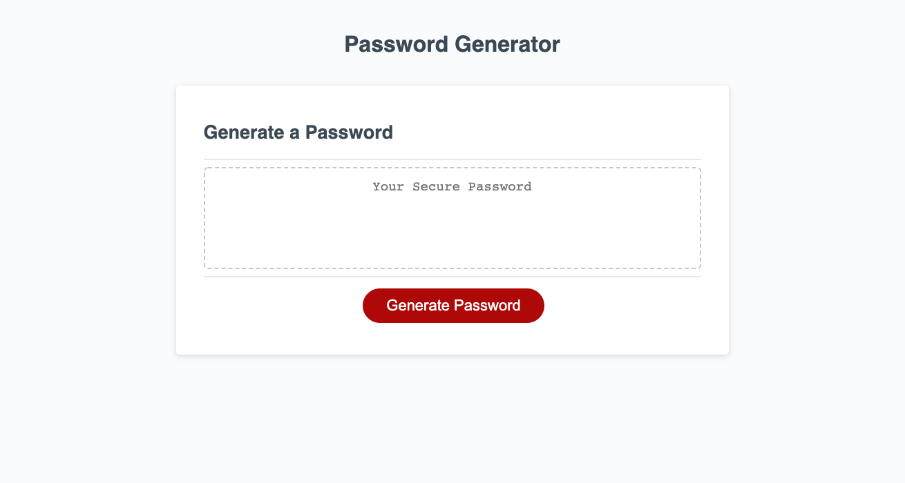
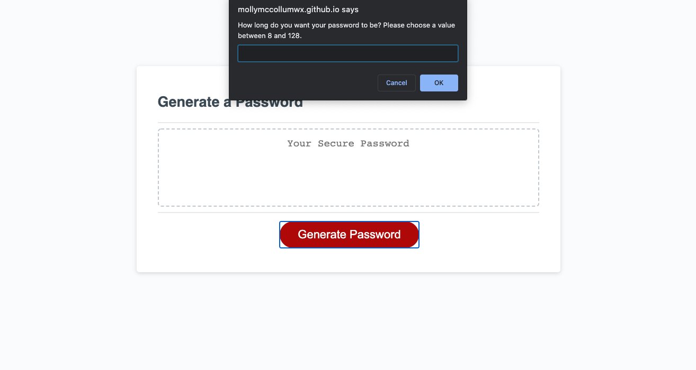
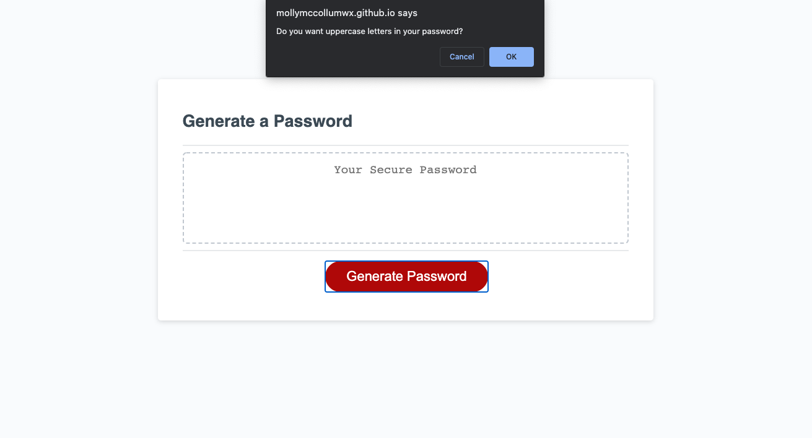

# Password Generator

This webpage generates a random password after asking the user for both the desired length of the password and the types of characters in the password. The randomization creates a strong password that provides greater security to protect sensitive data. 

The HTML/CSS was provided by GA Tech Coding Bootcamp. The developer was asked to construct a JavaScript file that did the following:

* Display a series of prompts for the user to pick password criteria (length and types of characters)
* Validate the input selections
* Randomly generate the password based on the user selection and display the new password on the page

## Installation

---
The code for this webpage can be found at [Github](https://github.com/mollymccollumwx/password-generator). The [deployed website](https://mollymccollumwx.github.io/password-generator/) features a simple design and singular purpose to generate a random password. 

## Usage

---

After pressing generate, the user is prompted for a desired password length between 8-128 characters. The user was also prompted to choose again if they picked a value below 8 or above 128.

The user was then provided with a series of confirms to determine what type of characters they wanted in their password (uppercase, lowercase, numbers, or special characters). If the user did not make any choices, they were alerted that they needed to pick at least one. 

Based on the user selection, the password was then generated in a random order and displayed on the screen. 

## Credits

---
This webpage was created while enrolled at the Georgia Tech Coding Bootcamp. Contributors include TAs and tutors who helped debug the code. 

## License

---

MIT License

Copyright (c) [2020] [Molly M]

Permission is hereby granted, free of charge, to any person obtaining a copy
of this software and associated documentation files (the "Software"), to deal
in the Software without restriction, including without limitation the rights
to use, copy, modify, merge, publish, distribute, sublicense, and/or sell
copies of the Software, and to permit persons to whom the Software is
furnished to do so, subject to the following conditions:

The above copyright notice and this permission notice shall be included in all
copies or substantial portions of the Software.

THE SOFTWARE IS PROVIDED "AS IS", WITHOUT WARRANTY OF ANY KIND, EXPRESS OR
IMPLIED, INCLUDING BUT NOT LIMITED TO THE WARRANTIES OF MERCHANTABILITY,
FITNESS FOR A PARTICULAR PURPOSE AND NONINFRINGEMENT. IN NO EVENT SHALL THE
AUTHORS OR COPYRIGHT HOLDERS BE LIABLE FOR ANY CLAIM, DAMAGES OR OTHER
LIABILITY, WHETHER IN AN ACTION OF CONTRACT, TORT OR OTHERWISE, ARISING FROM,
OUT OF OR IN CONNECTION WITH THE SOFTWARE OR THE USE OR OTHER DEALINGS IN THE
SOFTWARE.